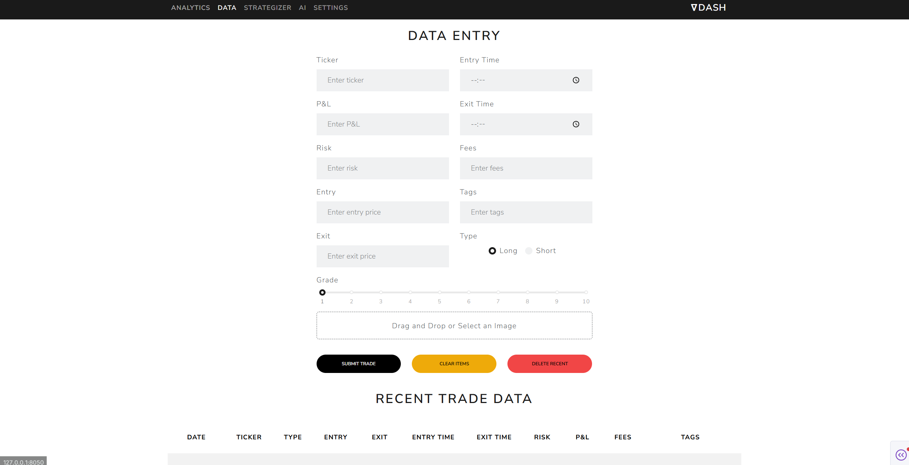

# ∇Dash - Trading Journal & Analytics  
  

## Features  
- Trade logging (SQLite backend)  
- Real-time trading analytics  
- Image uploads for trade receipts  

## Run Locally  
```bash
pip install -r requirements.txt  
python app.py
```
<!-- 
# A first-level heading
## A second-level heading
### A third-level headin


## This'll be a _Helpful_ Section About the Greek Letter Θ!
A heading containing characters not allowed in fragments, UTF-8 characters, two consecutive spaces between the first and second words, and formatting.

## This heading is not unique in the file

TEXT 1

## This heading is not unique in the file

TEXT 2

# Links to the example headings above

Link to the sample section: [Link Text](#sample-section).

Link to the helpful section: [Link Text](#thisll-be-a-helpful-section-about-the-greek-letter-Θ).

Link to the first non-unique section: [Link Text](#this-heading-is-not-unique-in-the-file).

Link to the second non-unique section: [Link Text](#this-heading-is-not-unique-in-the-file-1).

Here is a simple footnote[^1].

A footnote can also have multiple lines[^2].

[^1]: My reference.
[^2]: To add line breaks within a footnote, prefix new lines with 2 spaces.
  This is a second line.

TOOLTIPS

> [!NOTE]
> Useful information that users should know, even when skimming content.

> [!TIP]
> Helpful advice for doing things better or more easily.

> [!IMPORTANT]
> Key information users need to know to achieve their goal.

> [!WARNING]
> Urgent info that needs immediate user attention to avoid problems.

> [!CAUTION]
> Advises about risks or negative outcomes of certain actions.

Text that is not a quote
> Text that is a quote

QUOTING CODE
Some basic Git commands are:
```
git status
git add
git commit
```

Use `git status` to list all new or modified files that haven't yet been committed.
->